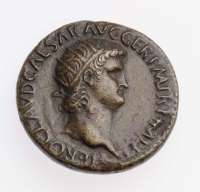

# Roman Coinage
This is the first web page I ever built! I made it during my LaunchCode LC101 bootcamp as a way to combine what I already knew and loved from my first career (Classics professor) with my early skills in HTML and CSS.  

And anyway, Roman coins are always cool!

## My Web Development 'Time Capsule'
The `LC101` branch represents the code that I wrote for my bootcamp assignment, and I was very proud of it at the time. 🙂

What you see in the `main` branch is the current state of the page. At the moment, it's the same, but as I learn new things I will continue to tweak the code to improve the page. 

## Future Improvements
The first two areas I plan to work on are: 
- Responsive layout (esp. typography and image sizing)
- Bootstrap 5

Down the road I look forward to adding some interactive JavaScript elements as well.

